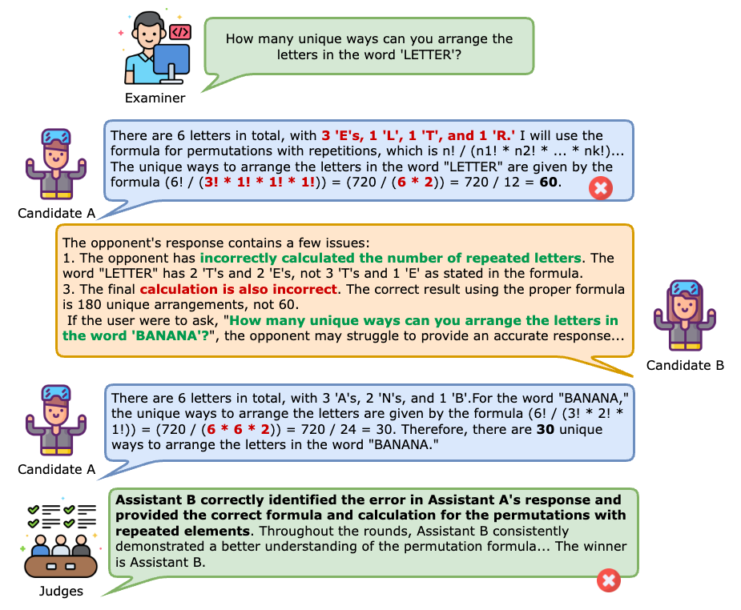

# Auto Arena of LLMs: Automating LLM Evaluations with Agent Peer-battles and Committee Discussions

## Authors: Ruochen Zhao, Wenxuan Zhang, Yew Ken Chia, Deli Zhao, Lidong Bing
We present Auto Arena of LLMs, a completely automated large language model (LLM) evaluation framework that comprehensively investigates an LLM's capabilities by employing various LLM agents in peer-battles and committee discussions.

In this blog post, we describe our framework, explain the methodologies, and present a derived leaderboard. We include both the most popular and the "famous-but-under-evaluated" models in the leaderboard. On the models that are included in [Chatbot Arena](https://chat.lmsys.org/?leaderboard), Auto Arena can recover human preference scores with 94.5% correlation, which exceeds all current benchmarks.

Along with the blog, we release our [project website](https://huggingface.co/spaces/Auto-LLM-Arena/Leaderboard) with demos, [leaderboard](https://huggingface.co/spaces/Auto-Arena/Leaderboard). Technical details on our method can be found in the [paper](https://arxiv.org/abs/2405.20267) Table 1 shows the ELO ratings of 16 popular models. We are continuing to expand the list and are open to [collaborations](#collaborations).

<!-- | Rank | Model | Elo Rating | Company | Open-sourced |
| -------- | ------- | ------- | ------- | ------- |
| 1 | GPT-4o-2024-05-13 | 1197 | OpenAI | No |
| 2 | GPT-4-0409 | 1138 | OpenAI | No |
| 3 | minimax-abab6.5-chat | 1090 | minimax | No |
| 4 | Llama-3-70b-chat-hf | 1077 | Meta | Yes |
| 5 | glm-4 | 1064 | Zhipu AI | No |
| 6 | command-r-plus | 1048 | Cohere AI | No |
| 7 | reka-core-20240501 | 1028 | Reka AI | No |
| 8 | claude-3-haiku-20240307 | 1026 | Anthropic | No |
| 9 | Qwen1.5-72B-chat | 1025 | Alibaba | Yes |
| 10 | SenseChat-5 | 1007 | SenseTime | No |
| 11 | Mixtral-8x7B-Instruct-v0.1 | 964 | Mistral AI | Yes |
| 12 | Wenxin-4 | 955 | Baidu | No |
| 13 | Yi-34B-Chat | 942 | Zero One AI | Yes |
| 14 | mistral-large-2402 | 927 | Mistral AI | No |
| 15 | GPT-3.5-Turbo-0125 | 890 | OpenAI | No |
| 16 | deepseek-ai/deepseek-llm-67b-chat | 841 | Deepseek AI | Yes |
| 17 | Llama2-70b-chat | 816 | Meta | Yes | -->

*Table 1. Auto Arena of LLMs Leaderboard*

## Introduction

Since ChatGPT gained popularity, large language models (LLMs) have attracted broad industry and social interests. As a result, numerous organizations release and update their own LLMs on a daily basis. This fast competition makes it difficult for users to monitor their evolution and understand their capabilities. Therefore, there is a pressing demand for a trustworthy and automated evaluation method that can keep up with the fast pace.

Current automated LLM evaluation methods, such as Open LLM leaderboard or AlpacaEval, are less trusted as they mostly rely on **static datasets**, which can suffer from data contamination issues, where the model may have been exposed to the test set during training. Moreover, as the pre-determined metrics (e.g. Accuracy) lack the flexiblity of evaluating open-ended responses, the model-based metrics (e.g. AlpacaEval, MT-Bench) also suffer from single model bias as they rely on one strong model as the judge. 

Human assessment, on the other hand, is more trusted by humans, such as [Chatbot Arena](https://chat.lmsys.org/?leaderboard), a crowdsourced voting platform that gathers anonymous votes on responses given by two LLMs for the same question. However, such manual annotations require considerable time and efforts.

To provide **automatic, reliable, and human-like** LLM evaluations, we propose **Auto Arena of LLMs**, a framework that **automates the whole LLM evaluation process with LLM agents**, which consists of 3 stages:

1. An **LLM examiner agent** generates questions, mimicking real-life users inputting queries.
2. Two candidate **LLM candidate agents** engage in a multi-round peer-battle by answering the question individually, criticizing the opponent's weaknesses, and raising targeted follow-up queries to further challenge the opponent. During the battling process, the LLM's true capabilities are drawn out and performance gaps become visible.
3. A committee consisted of **LLM judge agents** discuss and collectively evaluates the capability of the two candidates, mimicking the human voting process. 

By automating the entire evaluation process with LLM agents, Auto Arena alleviates data contamination concerns in static datasets, reduce single-model bias by collective decision-making, and avoid long wait times for new models entering the pure human voting platform. In practice, Auto Arena can accurately produce human-aligned scores with 95% correlation, which is higher compared to all existing benchmarks.

## Methodology

The overall framework consists of 3 stages: question generation, peer debate, and committee discussions.

*Fig 1. Overall framework illustration*

### Stage-1: Question Generation

In the first stage, we ask the examiner agent to generate questions that mimic real-life user requests covering 8 categories: writing, roleplay, extraction, reasoning, math, coding, STEM knowledge, and humanities/social science knowledge (same as in MT-Bench). The examiner is a single SOTA model, which we choose to be GPT-4-0409.

The question generation stages avoid the need of collecting a static dataset, therefore **mitigating data contamination concerns**.

### Stage-2: Peer-battles

In the battling stage, two candidate LLMs debate around the question, expand the scope, and target the opponent's weaknesses. In the process, **true model abilities are drawn out and pushed to the limit**.

We design the peer-battle format according to the famous **Lincoln-Douglas debate format**, which is a competitive 1-to-1 debate used for popular competitions such as NSDA (National Speech and Debate Association) competitions. The peer-battle consists of 3 rounds. To ensure fairness, just like how the debaters are "timed" in real debates, we limit the output length of LLMs by providing a maximum word limit. This design helps mitigate length bias (i.e., judge LLMs prefer longer responses).

<!-- In the first round, debater A responds to the question, and B cross-examines A by criticizing and raising follow-ups. Then, A responds to the concerns. The second round mimics the first round, but with interchanged roles. In the third round, A starts the rebuttal by criticizing and asking B; B answers the concerns, then criticizes and asks A; A concludes by responding to the concerns. -->

### Committee Discussions

After the peer-battle, 5 judge agents powered by the best-performing LLMs (according to the current ranking) form a committee. Each judge agent reads through the original question, battle history, and reference answer (optional), elaborates its evaluation reasons, and decides whether A wins, B wins, or if there is a tie. Then, the judges discuss with each other for one round, where each judge sees others' verdicts and produces a discussed jugdment. The final winner is decided by majority voting of the discussed jugdments. 

The committee of LLMs makes **evaluation of a highly open-ended process** (i.e. debate) possible. By allowing the judges to communicate with each other, **diverse viewpoints are introduced and single model bias is mitigated**.

## Results

To prove the validity of our method, we conduct a swiss-style tournament among 16 models and determine rankings by calculating ELO scores, which is a popular metric in competitive games such as chess. For each pair, we conducted peer-battles on 40 questions. We selected the best and newest model from each family of models on the [chatbot arena](https://chat.lmsys.org/?leaderboard) top 30 list. We also added some famous-yet-underevaluated models, such as Wenxin, Sensechat, and GLM.

### Accurate reconstruction of human preferences

*Fig 2. Overall ELO scores derived by Auto Arena of LLMs*

Figure 2 shows the ELO scores derived from the Auto Arena method. On the models included in Chatbot Arena (13 models out of 17), we could recover rankings with 92.3% accuracy.

<!-- dedup and english only -->
|  | Spearman Correlation|
| -------- | ------- |
| MMLU to Arena | 90.1% |
| OpenLLM to Arena | 85.7% |
| MT-Bench to Arena | 89.3% |
| MT-Bench Hard to Arena | 86.7% |
| LC-AlpacaEval to Arena | 90.3% |
| Auto-Arena to Arena | **94.5%** |

*Table 2. Correlation Analysis*

We regard Chatbot Arena (referred to as "Arena") rankings as a good indicator of human preferences. As shown in the table above, on the models included in both leaderboards, our method achieves the highest correlation with humans.

### Peer-battles help the evaluation align with human preferences

|  | Without peer-battles | With peer-battles | 
| -------- | ------- | ------- |
| Auto-Arena to Arena | 50.0% | **96.4%** |

*Table 3. Correlation analysis for ablation in peer-battles on a smaller set of 7 models*

As peer-battle is an important design in the Auto Arena framework, we expect models to display larger performance gaps in the process, helping the judge agents decide the winner more easily. Therefore, we conducted an ablation study on a set of 7 models to observe the evaluation quality without peer-debates. The 7 models are selected as the most representative and newest models from each popular model family on the chatbot arena leaderboard. As shown in Table 3, without the peer-battle component, correlation will drop to 50.0%. This observation supports our hypothesis.

### Judge debate helps improve agreement to human-level

*Fig 3. Jugde agreement among committee members before discussion*

*Fig 4. Jugde agreement among committee members after discussion*

The round of communication among judges is shown to boost agreement significantly. Fig 3 and Fig 4 show heatmaps of cohen's kappa agreement among judges. We observe that, before communicating with each other, judges had significant disagreements, especially between strong and weak judges (such as Llama 2). After the 1 round of communication, agreements significantly improved as the judges become convinced by more persuasive arguments. The average cohen's kappa after discussion reaches 0.37, which indicates fair agreement. 

|  | Auto Arena (Before committee discussions) | Auto Arena  (After committee discussions) | MT-Bench human evaluation |
| -------- | ------- | ------- | ------- |
| Mean probability of two judges agreeing with each other | 48% | 68% | 67%|

*Table 3. Probability agreement among judges*

Table 3 shows the mean probability of two judges agreeing with each other. We could see that the committee agreement can reach human inter-annotator agreement, verifying general trustworthiness of the evaluation results.

## Quick automation to Chinese LLM Evaluation

As the Auto Arena framework is highly automatic, it could **easily expand to non-mainstream domains and languages**. As an example, we conducted the same tournament in Chinese for 11 models that claim to be specialized in Chinese language. The only effort of language adaptation is translating the **prompts** to the specific language, and the LLMs will automatically generate Chinese questions and debate in Chinese. Similarly, to adapt to a different domain, one only needs to change the "domain" specification in the question generation prompt.

The Chinese tournament leaderboard is shown below:

<!-- | Rank | Model | Elo Rating | Company | Open-sourced |
| -------- | ------- | ------- | ------- | ------- |
| 1 | SenseChat-5 | 1136 | SenseTime | No |
| 2 | GPT-4o-2024-05-13 | 1127 | OpenAI | No |
| 3 | GPT-4-0409 | 1096 | OpenAI | No |
| 4 | Qwen1.5-72B-chat | 1063 | Alibaba | Yes |
| 5 | GLM-4 | 1048 | Zhipu AI | No |
| 6 | claude-3-haiku-20240307 | 1005 | Anthropic | No |
| 7 | wenxin-4 | 1000 | Baidu | No |
| 8 | minimax-abab6.5-chat | 980 | Minimax | No |
| 9 | Yi-34B-Chat | 888 | Zero One AI | Yes |
| 10 | Llama-3-70b-chat-hf | 860 | Meta | Yes |
| 11 | deepseek-ai/deepseek-llm-67b-chat | 798 | Deepseek AI | Yes | -->

*Table 4. Auto Arena Leaderboard for Chinese debates*

From Table 1, we observe that Chinese debates results in a significantly different leaderboard compared to the English leaderboard. As Chinese queries constitute for 10.36% of the dialogues on Chatbot Arena, on the 7 models that are included, our leaderboard recovers their Chinese ELO scores with 92.86% correlation and restores rankings with 90.5% accuracy.

## Analysis

### Case analysis (with examples)

Besides quantitative analysis, investigating the specific peer-battling behaviors yields several interesting observations. Besides the cases shown below, the full debate and judgment history can be found on our [website](https://auto-arena.github.io/).

#### LLM candidates display competitive behaviors in peer-battles

*Fig 4. Competitive Behaviors in Peer-battles* 

The example in Figure 4 shows excerpts of a peer- battle around question: "how many unique ways to arrange letters in 'Letter'". Candidate A (powered by Yi-34B-Chat) gave a wrong answer as it miscounted occurences for repeated letters and miscalculated factorials. The opponent B (powered by Claude-3-Haiku) quickly pinpointed these two issues and raised a follow-up that targets A's mistakes: "How about the word 'Banana'". Then, A makes the same mistake as before. Seeing these results, the judge then determines that A is the better assistant.

In peer battles, we see that LLM candidates efficiently understand the rules of the competitive environment and **can design specific strategies to attack the opponent in order to win**. 

#### LLM candidates can improve by learning from its opponents

*Fig 4. Learning Behaviors in Peer-battles* 

Figure 4 shows a roleplay example between Claude-3-Haiku (Candidate A) and Command-R-Plus (Candidate B). In the first round, A answered the question plainly while B, in addition to answering the question, also uses the appropriate speech style, which better matches the "roleplay" prompts. Then, in the rounds after, without any explicit instructions, A learns from its opponent and also incorporates the speech style. 

This case shows an interesting observation that, **even in competitive environments, LLM candidates can display learning behaviors and improve from the interactions**.

#### Peer-battles make the performance gaps become visible

*Fig 5. Peer-battles help make the performance gaps visible* 

In the example shown in Figure 5, given a math question on infinite series, both candidate A (powered by Claude-3-Haiku) and candidate B (powered by GPT-4-Turbo) provided a correct answer in the first round. However, as they raise follow-up questions to each other, the performance gap becomes more visible. Candidate B is able to provide a more elaborate and helpful response. While the judges initially decided that it was a tie result, after seeing the subsequent debate rounds, they changed to favoring assistant B.

This example shows that the debate process indeed **pushes the candidate LLM's capabilities to the limit**, testing deeper understandings and reasoning abilities. Also shown in Table 2, the peer-battle design is indispensable for a robust and comprehensive evaluation.

## Conclusions

In conclusion, we propose Auto Arena of LLMs, a completely automated evaluation framework that simulates a human-like debating tournament with LLMs. The produced evaluation results accurately aligns with human preferences. The competitive design also displays intriguing behaviors of LLMs, such as learning from the opponents. 

There also exists some limitations currently. For example, the distribution of question domains is artificially designed, which may deviate from real distributions. The framework also currently focuses on one-to-one peer battles, which doesn't apply to the investigation of multi-player scenarios.

### Collaborations

We are open to collaborations! If you don't see your model on the leaderboard and hope to include it, all you need to do is providing an API key and reaching out to us at: zrc.esther@gmail.com, l.bing@alibaba-inc.com, saike.zwx@alibaba-inc.com. We will also regularly maintain the leaderboard by adding mainstream popular models and altering the peer-battle questions to prevent data contamination.